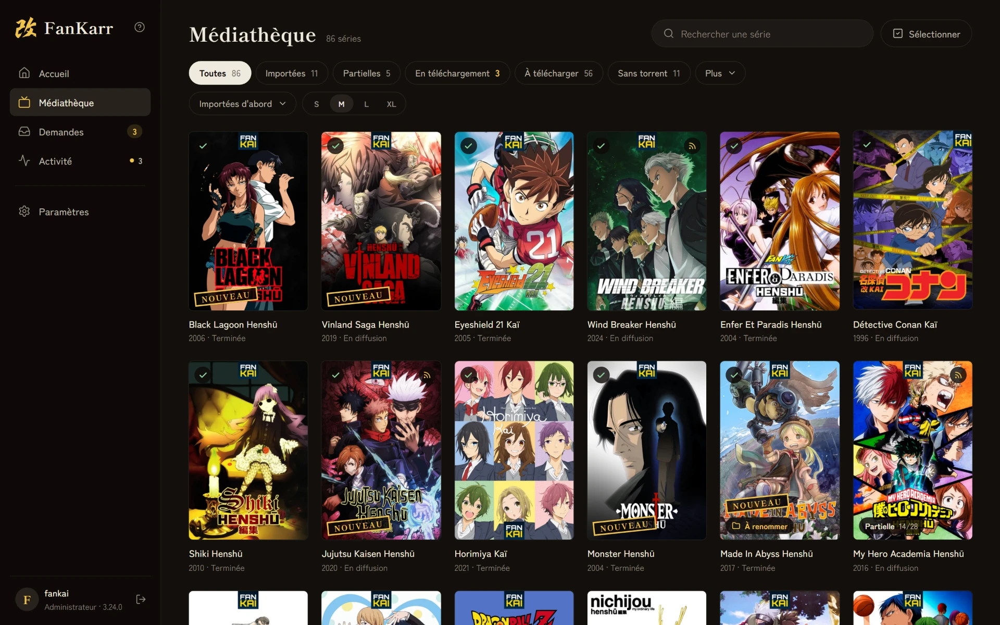
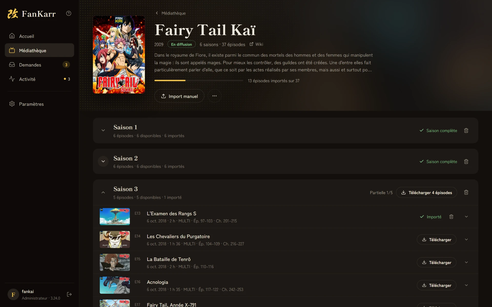
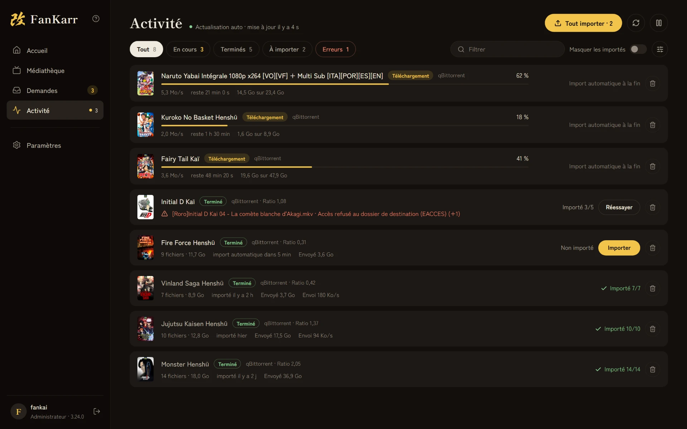
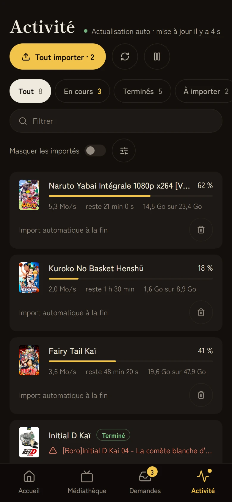
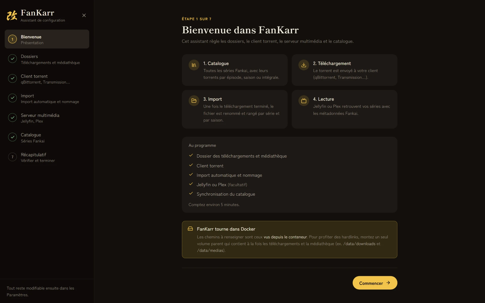
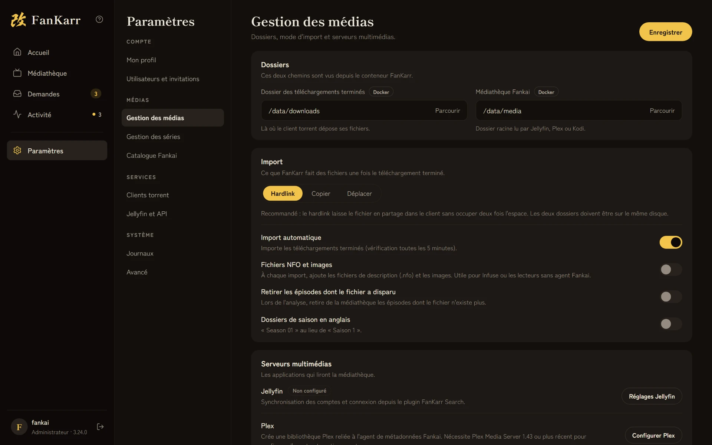
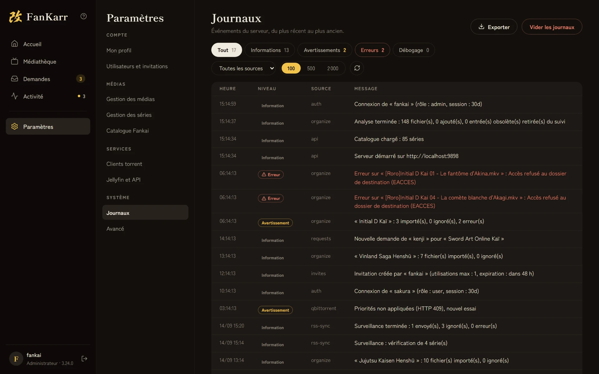

<div align="center">

# FanKarr


**Gestionnaire de téléchargements pour le catalogue [Fankai](https://fankai.fr)**  
Inspiré de Radarr et Sonarr, pour les éditions Kai et Yabai


</div>

---

## Aperçu


> Accueil : le dernier import, les séries ajoutées récemment et les chiffres de la médiathèque. L'administrateur y retrouve ce qui attend une action : demandes, imports en erreur, dossiers à renommer.

---



> Médiathèque : tout le catalogue Fankai. Chaque affiche indique l'état de la série (importée, partielle, en téléchargement, dossier à renommer, nouveauté), avec des filtres, un tri et plusieurs tailles d'affiches.

---



> Fiche d'une série : l'import saison par saison et épisode par épisode, avec le téléchargement d'un épisode, d'une saison ou de toute la série, l'import manuel et la surveillance des nouveaux épisodes.

---



> Activité : un torrent par ligne, du téléchargement à l'import, avec le détail des erreurs et un bouton pour relancer l'import.

---

<p align="center">
  
  
  
</p>

> Sur mobile : l'interface s'adapte au téléphone, avec une barre d'onglets en bas de l'écran.

---

## Fonctionnalités

### Téléchargement
- Tout le catalogue Fankai, avec les affiches et l'état de chaque série
- Envoi au client torrent par épisode, par saison ou en intégrale
- Choix de la source quand plusieurs torrents existent (qualité, pack)
- Bouton « Tout télécharger » : l'intégrale choisie, complétée par les packs des épisodes qu'elle ne contient pas
- Progression par épisode, même pour un fichier contenu dans un pack (si le client torrent l'indique)
- Surveillance : les nouveaux épisodes des séries surveillées sont envoyés au client (vérification toutes les 6 heures)

### Organisation
- Import automatique des téléchargements terminés dans la médiathèque (vérification toutes les 5 minutes)
- Trois modes d'import : Hardlink (recommandé), Copier ou Déplacer. Avec un hardlink, le client torrent continue de partager le fichier.
- Analyse de la médiathèque : les épisodes déjà présents sur le disque sont reconnus sans être déplacés
- En option, les épisodes dont le fichier a disparu sont retirés de la médiathèque
- Quand vous retirez une série de la médiathèque en supprimant ses fichiers, son dossier est effacé et ses torrents sont retirés du client

### Demandes
- Les invités demandent une série, une saison ou des épisodes, depuis FanKarr ou depuis le plugin Jellyfin
- Les administrateurs approuvent, refusent (avec un message) ou marquent une demande comme disponible
- Approbation automatique, pour tous les invités ou certains seulement : la demande est approuvée et le torrent part aussitôt au client
- Bouton « Tout supprimer » pour vider la liste
- Une demande passe à « disponible » quand des épisodes de la série sont importés, et les demandes disponibles sont supprimées quand la série est retirée de la médiathèque

### Métadonnées et affichage
- Badges de langue VOSTFR et MULTI sur chaque épisode, détectés automatiquement
- Fichiers NFO et images en option, pour Infuse ou les lecteurs sans agent Fankai
- Plex : connexion au compte, installation de l'agent de métadonnées Fankai et création de la bibliothèque (Plex Media Server 1.43 ou plus récent pour l'agent)
- Jellyfin, Emby et Kodi : métadonnées Fankai avec le [plugin Jellyfin Fankai](https://github.com/Nackophilz/fankai_jellyfin) ou l'add-on [Fankai pour Kodi](https://github.com/Nackophilz/fankai_kodi) (Kodi 20 ou plus récent)

### Utilisateurs et Jellyfin
- Plusieurs comptes, avec deux rôles (administrateur et invité) et des liens d'invitation
- Synchronisation Jellyfin : un compte FanKarr est créé pour chaque utilisateur Jellyfin, toutes les heures ou à la demande
- Connexion depuis le plugin Jellyfin avec le compte Jellyfin
- Un jeton d'API personnel par utilisateur pour l'API publique

### Système
- Journaux filtrables par niveau et par source, avec rotation automatique, que vous pouvez vider depuis l'interface
- Authentification par mot de passe, session JWT
- Clients torrent pris en charge : qBittorrent, Transmission, Deluge, rTorrent, uTorrent, Synology Download Station et Real-Debrid. Vous pouvez en configurer plusieurs.
- Installation avec Docker, Runtipi ou un binaire autonome

---

## Données des torrents (scraper)

Les données du catalogue viennent du dépôt [`fankarr-scraper`](https://github.com/masutayunikon/fankarr-scraper).

Ce dépôt récupère les torrents Fankai sur les trackers publics, les associe aux épisodes grâce à l'API Fankai et publie le résultat toutes les 6 heures avec GitHub Actions : un fichier par série dans le dossier `series/`, et des fichiers d'index à la racine (`available.json`, `infohash_map.json`).

FanKarr lit ces données au démarrage et les garde une heure en cache. Pour les recharger tout de suite, utilisez **Synchroniser maintenant** dans **Paramètres › Catalogue Fankai**. Les séries qui ne sont pas encore dans le scraper sont complétées par l'API Fankai, sans torrents. La collecte des torrents ne se fait pas sur votre serveur.

---

## Installation

### Docker Compose (recommandé)

**Prérequis** : Docker et Docker Compose, et un client torrent joignable depuis FanKarr.

```yaml
services:
  fankarr:
    image: masutayunikon/fankarr:latest
    container_name: fankarr
    environment:
      - PUID=1000        # UID de votre utilisateur (id -u)
      - PGID=1000        # GID de votre utilisateur (id -g)
      - TZ=Europe/Paris  # Fuseau horaire
    volumes:
      - ./config:/config  # Configuration, journaux et données
      - /votre/chemin:/media  # Dossier parent de la médiathèque et des téléchargements (nécessaire aux hardlinks)
    ports:
      - 9898:9898
    restart: unless-stopped
```

```bash
docker compose up -d
```

> **Hardlinks** : le dossier des téléchargements terminés et la médiathèque doivent être sur le même système de fichiers. Montez un seul volume parent qui contient les deux (ex. `/votre/chemin:/media`), puis choisissez vos dossiers à l'intérieur, comme avec Radarr et Sonarr.
>
> Vous pouvez monter plusieurs volumes, mais les hardlinks ne fonctionnent pas d'un volume à l'autre ; FanKarr copie alors les fichiers.
>
> Si le client torrent tourne dans un autre conteneur ou sur une autre machine, renseignez dans ses réglages le chemin distant (le dossier tel que le client le voit) et le chemin local (le même dossier tel que FanKarr le voit).

---

### Binaire autonome (Windows, Linux, macOS)

Téléchargez l'archive de votre système depuis les [Releases GitHub](https://github.com/masutayunikon/fankarr/releases/latest) :

| Système                                  | Archive                            |
| ---------------------------------------- | ---------------------------------- |
| Windows x64                              | `fankarr-windows-x64.zip`          |
| Windows x64, anciens processeurs         | `fankarr-windows-x64-legacy.zip`   |
| Linux x64                                | `fankarr-linux-x64.zip`            |
| Linux ARM64                              | `fankarr-linux-arm64.zip`          |
| macOS (Apple Silicon)                    | `fankarr-macos.zip`                |

Extrayez l'archive dans un dossier. Tous les fichiers doivent rester ensemble :

```
fankarr/
├── fankarr.exe          # à lancer (fankarr sous Linux et macOS)
├── organize-worker.js   # tâche d'import, à garder à côté du binaire
├── public/              # fichiers de l'interface, à garder à côté du binaire
├── version.txt
└── .env                 # facultatif, à créer (voir Variables d'environnement)
```

> Le fichier `.env` sert à régler le port, la durée des sessions, etc. sans passer par les variables d'environnement du système. S'il est présent à côté du binaire, il est chargé au démarrage. Le fichier [`.env.example`](.env.example) du dépôt sert de modèle.

**Linux et macOS** : dans l'archive, le binaire est rangé dans un sous-dossier `binaries/`. Placez-le à côté de `public/` et rendez-le exécutable avant le premier lancement :

```bash
wget https://github.com/masutayunikon/fankarr/releases/latest/download/fankarr-linux-x64.zip
unzip fankarr-linux-x64.zip -d fankarr
cd fankarr
# Le binaire est extrait dans binaries/ : le placer à côté de public/ et de organize-worker.js
mv binaries/fankarr .
chmod +x fankarr
./fankarr
```

Pour Linux ARM64 ou macOS, remplacez le nom de l'archive.

FanKarr est alors accessible sur `http://localhost:9898`. La configuration, les journaux et les données sont enregistrés dans un dossier `config/`, créé automatiquement à côté du binaire.

---

### Variables d'environnement

| Variable            | Défaut        | Description                                                                          |
| ------------------- | ------------- | ------------------------------------------------------------------------------------ |
| `PUID`              | `1000`        | UID propriétaire des fichiers de `/config` (Docker)                                  |
| `PGID`              | `1000`        | GID propriétaire des fichiers de `/config` (Docker)                                  |
| `TZ`                | non défini    | Fuseau horaire (ex. `Europe/Paris`)                                                  |
| `PORT`              | `9898`        | Port d'écoute du serveur                                                             |
| `JWT_SECRET`        | généré        | Secret des sessions, généré dans `secret.key` (dossier de configuration) si absent   |
| `AUTH_TOKEN_EXPIRY` | `30d`         | Durée de validité de la session (ex. `7d`, `1y` ; `never` ou `0` : pas d'expiration) |
| `GITHUB_BASE`       | dépôt scraper | Adresse de base des données du scraper, si vous hébergez votre propre copie          |

Par défaut, `GITHUB_BASE` vaut `https://raw.githubusercontent.com/masutayunikon/fankarr-scraper/main`.

---

### Premier lancement

1. Ouvrez `http://localhost:9898` (ou l'adresse de votre serveur).
2. Créez le compte administrateur.
3. Suivez l'assistant de configuration :
   - dossiers : téléchargements terminés, médiathèque et mode d'import (Hardlink, recommandé, Copier ou Déplacer) ;
   - client torrent ;
   - options d'import : import automatique, nommage des dossiers, fichiers NFO ;
   - serveur multimédia, Jellyfin ou Plex (facultatif) ;
   - catalogue : synchronisation des séries Fankai, puis analyse de la médiathèque si elle contient déjà des épisodes.
4. Terminez avec la visite guidée, qui présente les écrans principaux, ou passez-la.



Tous ces réglages restent modifiables dans les paramètres, et l'assistant peut être relancé.



---

## Organisation des fichiers

FanKarr range les fichiers terminés selon la structure attendue par Jellyfin et Plex :

```
Black Lagoon Henshū/
├── Saison 1/
│   ├── Black Lagoon Henshū.S01E01.MULTI.1080p.x264-FANKAI.mkv
│   ├── Black Lagoon Henshū.S01E02.MULTI.1080p.x264-FANKAI.mkv
│   ├── Black Lagoon Henshū.S01E03.MULTI.1080p.x264-FANKAI.mkv
│   └── Black Lagoon Henshū.S01E04.MULTI.1080p.x264-FANKAI.mkv
├── Saison 2/
│   ├── Black Lagoon Henshū.S02E05.MULTI.1080p.x264-FANKAI.mkv
│   ├── Black Lagoon Henshū.S02E06.MULTI.1080p.x264-FANKAI.mkv
│   └── Black Lagoon Henshū.S02E07.MULTI.1080p.x264-FANKAI.mkv
└── Saison 3/
    └── Black Lagoon Henshū.S03E08.MULTI.1080p.x264-FANKAI.mkv
```

Une option permet de nommer les dossiers de saison « Season 01 » plutôt que « Saison 1 ».

Le mode Hardlink est recommandé quand le dossier des téléchargements et la médiathèque sont sur le même système de fichiers : le fichier n'est pas copié et le client torrent continue de le partager.

L'import se lance :
- automatiquement, si l'import automatique est activé : FanKarr cherche les téléchargements terminés toutes les 5 minutes ;
- à la main, avec le bouton **Importer** de la page Activité.

L'analyse de la médiathèque (**Paramètres › Gestion des médias › Analyser la médiathèque**) reconnaît les fichiers déjà présents sur le disque sans les déplacer, utile pour une médiathèque existante.

---

## Journaux



> Les journaux sont dans **Paramètres › Journaux**. Chaque événement est horodaté et filtrable par niveau (`info`, `warn`, `error`, `debug`) et par source : `api`, `organize`, `rss-sync`, `requests`, `jellyfin`, `plex`, `auth`, `torrent-clients`, une source par client torrent (`qbittorrent`, `transmission`…), etc.

Le fichier garde environ les 2 000 dernières lignes. Les messages `debug` ne sont pas enregistrés quand `NODE_ENV=production`, ce qui est le cas dans l'image Docker.

---

## Plugin Jellyfin FanKarr Search

Un plugin Jellyfin intègre la recherche FanKarr à l'interface de votre serveur : vos utilisateurs parcourent le catalogue et demandent des séries sans quitter Jellyfin.

**[jellyfin-plugin-fankarr-search](https://github.com/Masutayunikon/jellyfin-plugin-fankarr-search)**

Le plugin nécessite **[Jellyfin JavaScript Injector](https://github.com/n00bcodr/Jellyfin-JavaScript-Injector)**. Les instructions d'installation sont dans le README du plugin.

### Synchronisation des utilisateurs

FanKarr crée un compte invité pour chaque utilisateur Jellyfin actif qui n'en a pas encore (même nom d'utilisateur). La synchronisation se fait :
- automatiquement toutes les heures, si Jellyfin est configuré ;
- à la demande, depuis **Paramètres › Jellyfin et API › Synchroniser les utilisateurs**.

Les comptes ainsi créés reçoivent un mot de passe aléatoire. Ces utilisateurs se connectent par le plugin, qui échange leur session Jellyfin contre leur jeton FanKarr.

---

## API publique

FanKarr expose une API publique, sous `/api/v1`, utilisée par le plugin Jellyfin et ouverte aux intégrations tierces.

**Authentification** : `Authorization: Bearer <jeton>` (jeton visible dans **Paramètres › Mon profil › Jeton d'API**)

| Méthode | Route | Description |
|---------|-------|-------------|
| `POST` | `/api/v1/auth/jellyfin` | Échange une session Jellyfin contre le jeton FanKarr de l'utilisateur |
| `GET` | `/api/v1/auth/me` | Compte associé au jeton |
| `GET` | `/api/v1/series/search?q=` | Recherche par titre ; renvoie note, année, description et demande en cours |
| `GET` | `/api/v1/series/:id` | Détail d'une série : saisons et épisodes |
| `POST` | `/api/v1/requests` | Crée une demande ou complète la demande en cours |
| `GET` | `/api/v1/requests` | Demandes de l'utilisateur du jeton |

### Connexion avec Jellyfin

```http
POST /api/v1/auth/jellyfin
Content-Type: application/json

{ "jellyfinUserId": "...", "jellyfinToken": "..." }
```

Renvoie `{ token, username, role }`. Le `token` s'utilise ensuite en `Bearer` pour tous les autres appels. Si aucun compte FanKarr ne porte le nom de l'utilisateur Jellyfin, la réponse est une erreur 404 : lancez la synchronisation Jellyfin.

### Recherche

```http
GET /api/v1/series/search?q=dragon+ball
Authorization: Bearer <jeton>
```

```json
[
  {
    "id": 42,
    "title": "Dragon Ball Z Kai",
    "original_title": "DRAGON BALL Z KAI",
    "image": "https://...",
    "year": 2009,
    "rating": 8.5,
    "description": "Suite de Dragon Ball...",
    "request": {
      "id": "uuid",
      "status": "pending",
      "seasons": [1, 2],
      "episodes": []
    }
  }
]
```

La recherche porte sur le titre et le titre original, sans tenir compte de la casse, parmi les séries présentes dans les données du scraper. Elle renvoie 50 résultats au maximum ; sans `q`, elle renvoie les 50 premières séries.

Le champ `request` vaut `null` si l'utilisateur n'a pas de demande en cours pour cette série.

### Détail d'une série (saisons et épisodes)

```http
GET /api/v1/series/42
Authorization: Bearer <jeton>
```

```json
{
  "id": 42,
  "title": "Dragon Ball Z Kai",
  "original_title": "DRAGON BALL Z KAI",
  "image": "https://...",
  "seasons": [
    {
      "season_number": 1,
      "episodes": [
        { "id": 101, "episode_number": 1, "title": "...", "image": "https://..." }
      ]
    }
  ]
}
```

### Créer une demande

```http
POST /api/v1/requests
Authorization: Bearer <jeton>
Content-Type: application/json

{ "serieId": 42, "serieName": "Dragon Ball Z Kai", "seasons": [1, 2] }
```

- `serieId` et `serieName` sont obligatoires.
- `seasons` : numéros de saison (`season_number`). Sans saison ni épisode, la demande porte sur toute la série.
- `episodes` : identifiants d'épisodes (`episode.id`). Prioritaires sur `seasons` s'ils sont renseignés.
- Si une demande est déjà en cours pour cette série, les saisons et épisodes sont **fusionnés**.
- Si l'approbation automatique est activée pour l'utilisateur, la demande est approuvée et le torrent envoyé au client.

---

## Runtipi

FanKarr est disponible dans le dépôt d'applications Runtipi de Masutayunikon. Pour l'installer :

1. Dans Runtipi, ouvrez **Paramètres › App Stores**.
2. Ajoutez l'adresse `https://github.com/Masutayunikon/runtipi-appstore`.
3. FanKarr apparaît dans la liste des applications : cliquez sur **Installer**.

---

## Technologies

| Partie            | Technologie                                       |
| ----------------- | ------------------------------------------------- |
| Interface         | Vue 3, Vite, Tailwind CSS v4                      |
| Serveur           | Express 5, TypeScript                             |
| Authentification  | JWT, bcrypt                                       |
| Import            | Worker threads Node (import en arrière-plan)      |
| Image Docker      | `node:22-slim`, pnpm, gosu (PUID/PGID)            |
| Binaire           | Bun (exécutable autonome, sans Node)              |

---

## Liens

- [fankai.fr](https://fankai.fr) : le projet Fankai
- [Plugin Jellyfin FanKarr Search](https://github.com/Masutayunikon/jellyfin-plugin-fankarr-search) : recherche et demandes FanKarr dans Jellyfin
- [Plugin Jellyfin Fankai](https://github.com/Nackophilz/fankai_jellyfin) : reconnaissance des métadonnées Fankai dans Jellyfin et Emby
- [Fankai pour Kodi](https://github.com/Nackophilz/fankai_kodi) : fournisseur de métadonnées Fankai pour Kodi
- [fankarr-scraper](https://github.com/masutayunikon/fankarr-scraper) : collecte des torrents
- [runtipi-appstore](https://github.com/Masutayunikon/runtipi-appstore) : dépôt d'applications Runtipi
