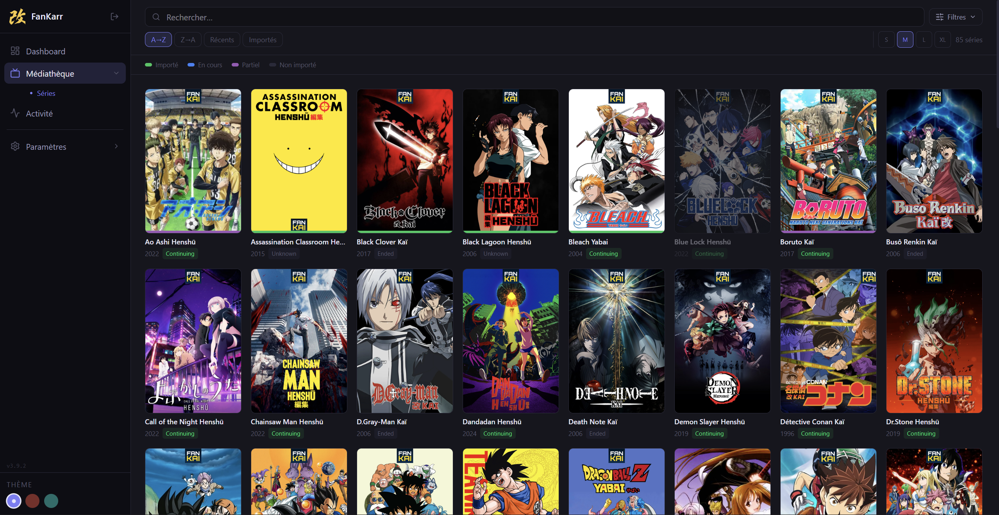
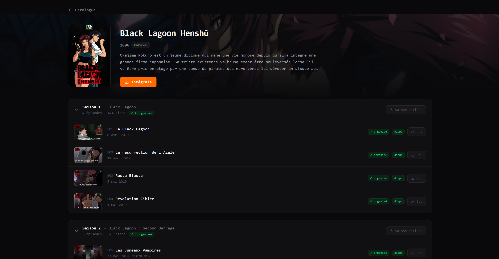
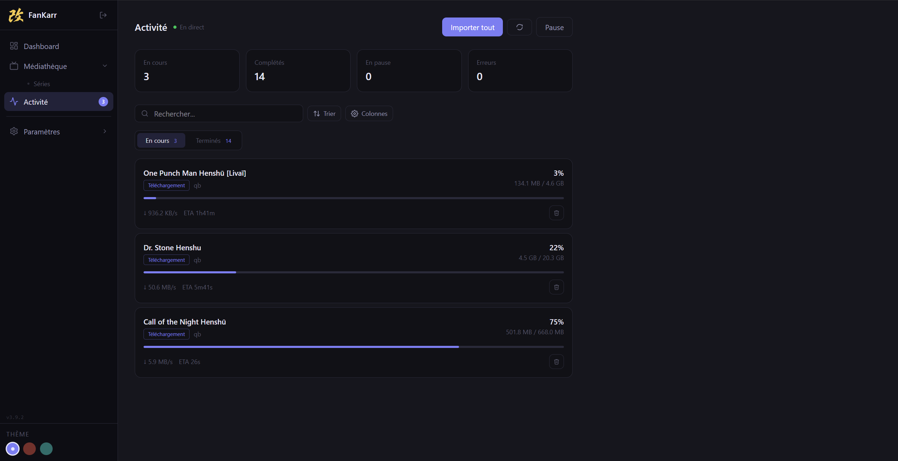
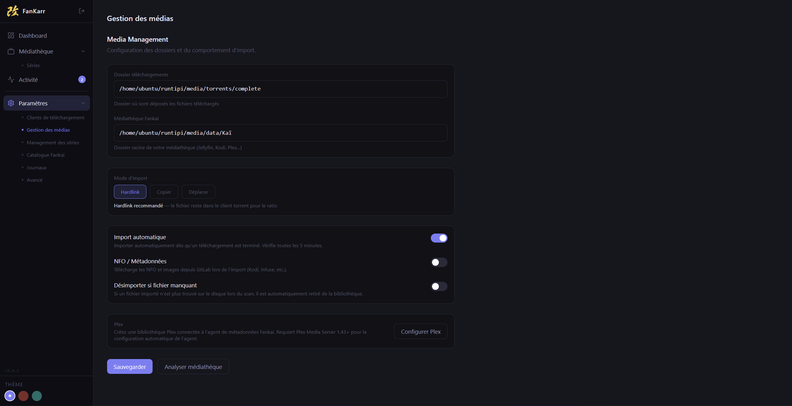
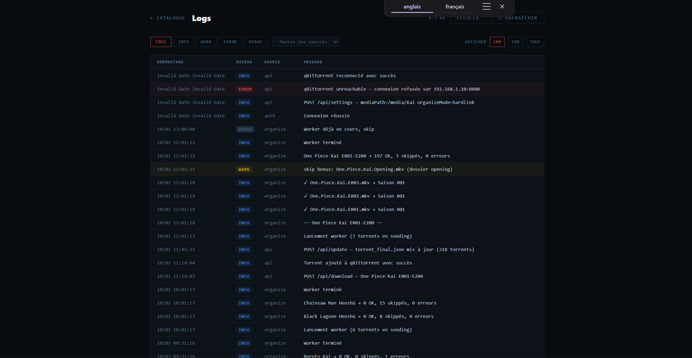

<div align="center">

# FanKarr


**Gestionnaire de téléchargements pour le catalogue [Fankai](https://fankai.fr)**  
Inspiré de Radarr/Sonarr — interface dédiée aux éditions Kai & Yabai


</div>

---

## Aperçu

<!-- [img] : vue catalogue complète — grille des affiches avec les barres d'état en bas de chaque affiche (couleurs : dispo / en cours / importé), barre de recherche visible -->


> Vue catalogue : toutes les séries Fankai. Une barre en bas de chaque affiche indique l'état — disponible, en cours de téléchargement ou déjà importé dans votre médiathèque.

---

<!-- [img] : vue série — détail des saisons et épisodes avec badges VOSTFR/MULTI + drapeaux, boutons de téléchargement avec dropdown multi-sources, barres de progression par épisode -->


> Vue série : épisodes avec badge de langue (VOSTFR / MULTI), progression par fichier, et dropdown de sélection quand plusieurs sources sont disponibles.

---

<!-- [img] : vue téléchargements — liste des torrents actifs avec barres de progression, état d'organisation, badges erreur au hover -->


> Vue téléchargements : suivi en temps réel, état d'organisation par torrent et détail des erreurs au survol.

---

## Fonctionnalités

### 📥 Téléchargement
- **Catalogue complet** des séries Fankai avec affiches et état de disponibilité
- **Téléchargement en un clic** vers votre client torrent — par épisode, par saison ou en intégrale
- **Dropdown intelligent** sur chaque bouton quand plusieurs sources sont disponibles (qualités différentes, packs différents)
- **"Tout télécharger"** unifié — sélectionne automatiquement les épisodes non couverts par l'intégrale choisie et complète avec les packs individuels
- **Progression par fichier** — barre de téléchargement au niveau de l'épisode, même pour les fichiers dans un pack intégrale

### 🗂️ Organisation
- **Import automatique** des fichiers terminés vers votre médiathèque, déclenché dès la fin d'un téléchargement ou toutes les 5 minutes en arrière-plan
- **Scan de médiathèque** — détecte les fichiers déjà présents sur le disque et les référence sans les déplacer
- **Mode hardlink** (recommandé), **déplacement** ou **copie** — le hardlink préserve le seeding du client torrent
- **Désimport automatique** optionnel quand un fichier est supprimé du disque

### 🏷️ Métadonnées & Affichage
- **Badges de langue** VOSTFR et MULTI avec drapeaux sur chaque épisode (détectés automatiquement)
- **Support NFO** — nommage compatible avec les plugins Jellyfin/Plex utilisant les fichiers `.nfo`
- **Intégration Plex** — connexion à votre serveur Plex pour déclencher le scan médiathèque après import

### ⚙️ Système
- **Logs centralisés** — filtre par niveau et source, rotation automatique, clear depuis l'UI
- **Authentification** par mot de passe avec session JWT
- **Multi-client torrent** — architecture extensible (qBittorrent supporté)
- **Compatible Docker / Runtipi / Binaire autonome**

---

## Données torrent — Scraper

Les données du catalogue sont récupérées depuis le repo [`fankarr-scraper`](https://github.com/masutayunikon/fankarr-scraper).

Ce repo contient un pipeline Python qui collecte, parse et résout les torrents Fankai depuis les trackers publics, les croise avec l'API metadata de Fankai pour identifier chaque épisode, et publie le résultat automatiquement **toutes les 6 heures** via GitHub Actions. Les données sont organisées par série dans un dossier `/serie` et des fichiers d'index à la racine du repo.

FanKarr récupère ces données au démarrage et via le bouton **Mettre à jour** dans les paramètres. Aucun scraping ne se fait en local.

---

## Installation

### Docker Compose (recommandé)

**Prérequis** : Docker + Docker Compose, un client torrent accessible en réseau.

```yaml
services:
  fankarr:
    image: masutayunikon/fankarr:latest
    container_name: fankarr
    environment:
      - PUID=1000        # UID de votre utilisateur (id -u)
      - PGID=1000        # GID de votre utilisateur (id -g)
      - TZ=Europe/Paris  # Votre timezone
    volumes:
      - ./config:/config  # Config, logs, base de données
      - /votre/chemin:/media  # Racine de votre médiathèque (voir note hardlinks)
    ports:
      - 9898:9898
    restart: unless-stopped
```

```bash
docker compose up -d
```

> **⚠️ Note sur les hardlinks** : Pour que le mode `hardlink` fonctionne, vos dossiers de téléchargement complets et votre médiathèque doivent être sur le **même filesystem**. La solution recommandée est de monter un seul volume racine (ex: `/votre/chemin:/media`) et de configurer vos chemins à l'intérieur — comme Radarr et Sonarr le font.
>
> Plusieurs volumes sont possibles mais les hardlinks ne fonctionneront pas entre deux volumes différents — FanKarr basculera automatiquement en copie.

---

### Binaire autonome (Windows / Linux / macOS)

Téléchargez l'archive correspondant à votre système depuis les [Releases GitHub](https://github.com/masutayunikon/fankarr/releases/latest) :

| Système                          | Archive                          |
| -------------------------------- | -------------------------------- |
| Windows x64                      | `fankarr-windows-x64.zip`        |
| Windows Legacy (anciens CPU)     | `fankarr-windows-legacy.zip`     |
| Linux x64                        | `fankarr-linux-x64.zip`          |
| macOS (Apple Silicon)            | `fankarr-macos.zip`              |

Extrayez l'archive — tous les fichiers doivent rester ensemble dans le même répertoire :

```
fankarr-windows-x64/
├── fankarr.exe        ← lancer ce fichier
├── organize-worker.js ← worker d'organisation (ne pas déplacer)
├── .env               ← configuration optionnelle (voir Variables d'environnement)
└── public/            ← assets frontend (ne pas déplacer)
```

> Le fichier `.env` permet de configurer le port, la durée des sessions, etc. sans passer par des variables d'environnement système. Il est chargé automatiquement au démarrage si présent à côté du binaire.

**Linux / macOS** — rendre le binaire exécutable avant le premier lancement :

```bash
wget https://github.com/Masutayunikon/FanKarr/releases/download/v3.14.6/fankarr-linux-arm64.zip
unzip fankarr-linux-arm64.zip -d fankarr
cd fankarr
################
# if the "fankarr" files in inside the binaries directory use this command
# mv ./binaries/fankarr .
##################
chmod +x fankarr
./fankarr
```

FanKarr sera accessible sur `http://localhost:9898`. La configuration, les logs et la base de données sont sauvegardés dans un dossier `config/` créé automatiquement à côté du binaire.

---

### Variables d'environnement

| Variable           | Défaut        | Description                                                                     |
| ------------------ | ------------- | ------------------------------------------------------------------------------- |
| `PUID`             | `1000`        | UID utilisateur pour les permissions fichiers (Docker)                          |
| `PGID`             | `1000`        | GID utilisateur pour les permissions fichiers (Docker)                          |
| `TZ`               | —             | Timezone (ex: `Europe/Paris`)                                                   |
| `PORT`             | `9898`        | Port d'écoute du serveur                                                        |
| `JWT_SECRET`       | auto-généré   | Secret JWT — généré automatiquement dans `/config/secret.key` si absent         |
| `AUTH_TOKEN_EXPIRY`| `30d`         | Durée de validité du token de connexion (ex: `7d`, `1y`, `never`)               |
| `DATA_DIR`         | `./config`    | Répertoire de stockage des données (binaire uniquement)                         |
| `GITHUB_RAW_URL`   | repo scraper  | URL de base du repo scraper si vous hébergez votre propre instance              |

---

### Premier démarrage

1. Ouvrir `http://localhost:9898`
2. Créer un mot de passe à la première connexion
3. Aller dans **Paramètres** → configurer votre client torrent
4. Renseigner le chemin vers le dossier des **torrents terminés** et celui de votre **médiathèque**
5. Choisir le mode d'organisation : `hardlink` (recommandé), `move` ou `copy`
6. Optionnel : lancer le **scan** pour référencer les fichiers déjà présents sur le disque
7. Retourner au catalogue et télécharger

<!-- [img] : page paramètres — formulaire de configuration client torrent, chemins, mode d'organisation, toggles autoImport / NFO / désimport auto -->


---

## Organisation des fichiers

FanKarr organise les fichiers terminés vers la structure attendue par Jellyfin / Plex :

```
Black Lagoon Henshū/
├── Saison 1/
│   ├── Black Lagoon Henshū.S01E01.MULTI.1080p.x264-FANKAI.mkv
│   ├── Black Lagoon Henshū.S01E02.MULTI.1080p.x264-FANKAI.mkv
│   ├── Black Lagoon Henshū.S01E03.MULTI.1080p.x264-FANKAI.mkv
│   └── Black Lagoon Henshū.S01E04.MULTI.1080p.x264-FANKAI.mkv
├── Saison 2/
│   ├── Black Lagoon Henshū.S02E05.MULTI.1080p.x264-FANKAI.mkv
│   ├── Black Lagoon Henshū.S02E06.MULTI.1080p.x264-FANKAI.mkv
│   └── Black Lagoon Henshū.S02E07.MULTI.1080p.x264-FANKAI.mkv
└── Saison 3/
    └── Black Lagoon Henshū.S03E08.MULTI.1080p.x264-FANKAI.mkv
```

Le mode **hardlink** est recommandé si vos dossiers de téléchargement et de médiathèque sont sur le même filesystem — les fichiers ne sont pas déplacés et le client torrent continue de seeder sans interruption.

L'organisation se déclenche :
- **Automatiquement** dès la fin d'un téléchargement, et toutes les 5 minutes en arrière-plan pour les torrents déjà en seeding
- **Manuellement** depuis le bouton **Importer** dans la vue téléchargements

Le **scan médiathèque** permet de référencer des fichiers déjà présents sur le disque sans les déplacer — utile si vous avez déjà une bibliothèque existante.

---

## Logs

<!-- [img] : page logs — liste des événements avec filtres niveau/source, bouton clear, affichage compact -->


> Tous les événements sont horodatés et filtrables par source (`organize`, `api`, `torrent`, …) et niveau (`info`, `warn`, `error`, `debug`).

---

## Runtipi

FanKarr est disponible dans l'appstore personnalisé. Pour l'installer :

1. Dans Runtipi, aller dans **Paramètres → App Stores**
2. Ajouter l'URL : `https://github.com/Masutayunikon/runtipi-appstore`
3. FanKarr apparaît dans le catalogue → **Installer**

---

## Stack technique

| Couche            | Technologie                              |
| ----------------- | ---------------------------------------- |
| Frontend          | Vue 3 + Vite + Tailwind CSS v4           |
| Backend           | Express 5 + TypeScript                   |
| Auth              | JWT + bcrypt                             |
| Worker            | Node Worker Threads (organisation async) |
| Packaging Docker  | `node:20-slim` + pnpm + gosu (PUID/PGID) |
| Packaging binaire | Bun (self-contained, pas de Node requis) |

---

## Liens

- [fankai.fr](https://fankai.fr) — Le projet Fankai
- [Plugin Jellyfin Fankai](https://github.com/Nackophilz/fankai_jellyfin) — Reconnaissance des métadonnées dans Jellyfin
- [fankarr-scraper](https://github.com/masutayunikon/fankarr-scraper) — Pipeline de collecte des torrents
- [runtipi-appstore](https://github.com/Masutayunikon/runtipi-appstore) — Appstore Runtipi personnel
